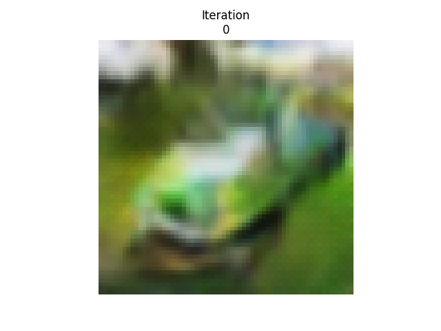
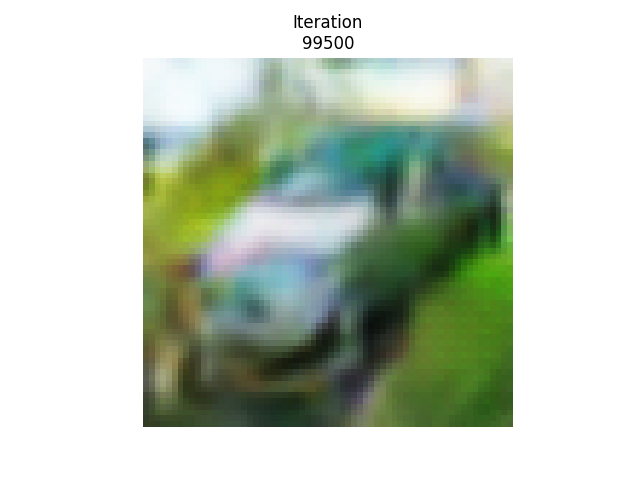

# Discriminator-Driven-Latent-Sampling (DDLS)
Reproduction of the NeurIPS 2020 conference article "Your GAN is Secretly an Energy-based Model and You Should Use Discriminator Driven Latent Sampling" (Tong Che &amp; Ruixiang Zhang et al.)

# Idea
According to the article, **energy-based models (EBM)** are models defined by the Boltzman distribution  which varies as $e^{E(x)}$, where $E(x)$ is the energy function.
The authors of article then show that, when the GAN is near optimality, the distribution of training data, $p_d$ very closely varies as $e^{logit(D(x))}$ which is the Boltzman distribution and hence, GANs can be viewed as EBMs.

In authors formulation, GAN generator (G) and discriminator (D) collaboratively learn an **"implicit" energy-based model**.

Sampling from **Energy-Based Models** refers to the process of generating new data points from a probabilistic model defined by an energy function. For sampling from an energy-based model, we can apply a Markov Chain Monte Carlo (MCMC) using Langevin Dynamics, but: 
1) doing MCMC in pixel space to sample from the model is impractical due to the high dimensionality and long mixing time
2) distribution of $p_g$ (generated "fake" data) is implicitly defined and its density cannot be computed directly

Instead, authors formulate an energy-based model in the latent space and propose to sample on the GAN latent space to generate improved samples with the energy function $E(z) = - \log p_0(z) - D(G(z))$, where $p_0$ is prior proposal distribution.

The proposed algorithm of the Discriminator Driven Latent Sampling is the following:


Note, that, according to authors, "in practice we will use a small, finite, value for $\epsilon$ in our experiments. In this case, one can add an additional layer
of M-H sampling, resulting in the **MALA algorithm**, to eliminate biases.

# Notebooks

## ```Synthetic_datasets.ipynb```
Reproduction of the experiments on synthetic datasets

Note the rate of changes in the generated points with increase in $\epsilon$


## ```Real_dataset_CIFAR10.ipynb```
Reproduction of the experiments on the real CIFAR10 dataset

Here is an example of improvement of car with DDLS

Before DDLS           | After DDLS     
:-------------------------:|:-------------------------:
  |  
